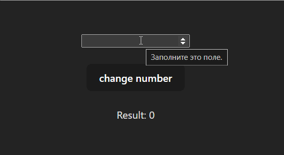

## React-redux

 

Число введенное в инпут записывается в глобальный state с помощью react-redux и при нажатии enter выводится в поле "Result:". 
При вводе в инпут другого числа оно будет прибавляться или вычитаться из результата, в зависимости от введенного знака перед числом

 

